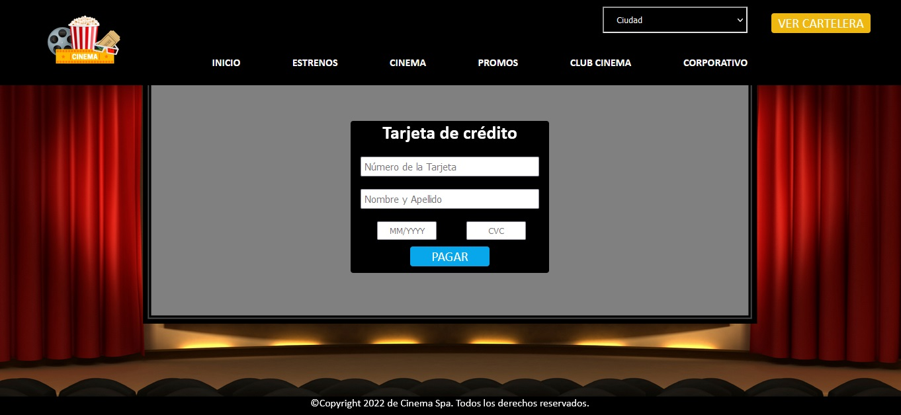
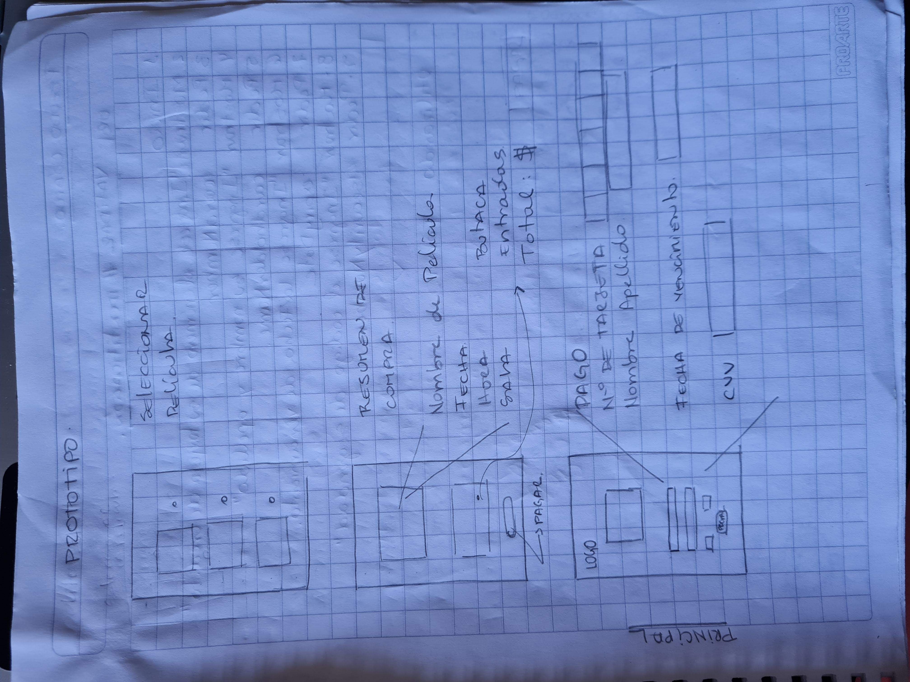
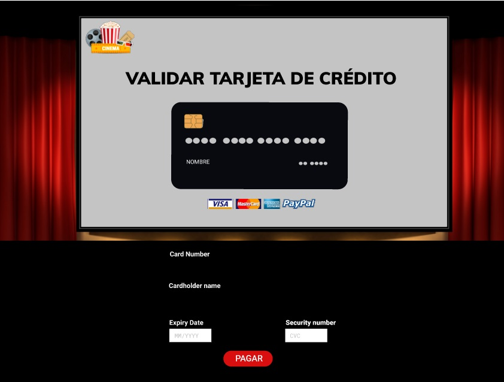

# Tarjeta de crédito válida - Cinema

* [Link proyecto:](https://danielaalcaladaboin.github.io/SCL019-card-validation/)

* [1. Preámbulo](#1-preámbulo)
* [2. Usuario, objetivo y beneficios del producto.](#2-usuario-objetivo-y-beneficios-del-producto)
* [3. Prototipo de baja fidelidad](#3-prototipo-baja-fidelidad)
* [4. Prototipo Final](#4-prototipo-final)

## 1. Preámbulo

Dada la pandemia muchas empresas han tenido que implementar un servicio de ecommerce en sus sitios web para facilitar la adquisición de sus servicios, entre ellos están los cines, quienes se han visto en la necesidad de renovar y mejorar el proceso de compra y venta de boletería tanto en físico como online. Por esta razón se decidió crear un producto enfocado en ellos. 

## 2. Usuario, objetivo y beneficios del producto.

El principal usuario de este producto es la empresa Cinema, ya que necesitaba actualizar su sitio web,  en especial la sección de compra online. Es sistema les permitirá estar en vanguardia del ecommer.  

La empresa Cinema al adquirir este producto podrá determinar qué tipo de tarjetas pueden realizar compras en su sitio web, tendrán la garantía de que las tarjetas utilizadas sean auténticas y acordes con los bancos con los que tienen convenio, también le garantizará a los usuarios confiabilidad y seguridad con sus datos bancarios. 

Debido a que en la actualidad sigue el crecimiento de hurto de datos y estafas por la web, con nuestro sistema de validación de tarjeta de crédito contribuimos a que nuestros clientes no sean víctimas estos actos.

## 3. Prototipo baja fidelidad:

## 4. Prototipo final:

